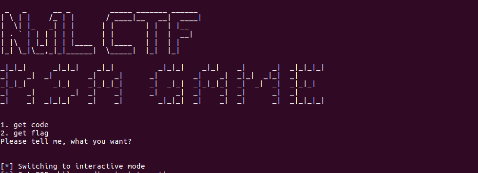

# RSA_Padding

**Challenge points**: 303  
  
**Challenge Description**: babyRSA  
  
There are two steps involved in the challenge:
1. Proof of Work
2. RSA encryption using user defined padding

## Proof of Work
We are given with the following condition to bypass as PoW:  
  
There is not much to explain here, wrote the following script to bypass the above conditions:
```python
from pwn import *
import hashlib
import string
from Crypto.Util.number import *
 
r = remote("47.75.39.249",'23333')
 
r.recvline()
str1 = r.recvline().strip()
print "condition: ", str1
 
prepend = str1[8:14]
sha_end = str1[len(str1)-15:len(str1)-10]
 
for i in string.letters + string.digits:
    for j in string.letters + string.digits:
        for k in string.letters + string.digits:
            for l in string.letters + string.digits:
                var = hashlib.sha256(prepend + i + j + k + l).hexdigest()[:5]
                if var == sha_end:
                    print "gotit!"
                    print "happening: ", r.recvline()
                    r.recvline()
                    r.sendline(i + j + k + l)
                    print r.recvuntil("want?\n\n")
                    r.interactive()
                    r.sendline("1")
                    print r.recvall()
                    exit()
                    break
print "Failed!"
```
  
## Message encryption using padded RSA
Upon successful validation of PoW, we are given a choice to select:  
  
1. get code
2. get message

We first select "get code" and get the source code of the encryption:  
```python
#!/usr/bin/env python3
# -*- coding=utf-8 -*-
 
from Crypto.Util.number import getPrime, GCD, bytes_to_long
from hashlib import sha256
import random
import signal
import sys, os
 
signal.alarm(20)
 
m = b"xxxxxxxxxxxxxx"
n = 21727106551797231400330796721401157037131178503238742210927927256416073956351568958100038047053002307191569558524956627892618119799679572039939819410371609015002302388267502253326720505214690802942662248282638776986759094777991439524946955458393011802700815763494042802326575866088840712980094975335414387283865492939790773300256234946983831571957038601270911425008907130353723909371646714722730577923843205527739734035515152341673364211058969041089741946974118237091455770042750971424415176552479618605177552145594339271192853653120859740022742221562438237923294609436512995857399568803043924319953346241964071252941
e = 3
 
def proof():
    strings = "abcdefghijklmnopqrstuvwxyzWOERFJASKL"
    prefix = "".join(random.sample(strings, 6))
    starwith = str(random.randint(10000, 99999))
    pf = """
sha256("%s"+str).hexdigest().startswith("%s") == True
Please give me str
"""%(prefix, starwith)
    print(pf)
    s = input().strip()
    if sha256((prefix+s).encode()).hexdigest().startswith(starwith):
        return True
    else:
        return False
 
def cmd():
    help = """
1. get code
2. get flag
Please tell me, what you want?
"""
    while True:
        print(help)
        c = input().strip()
        if c == "1":
            return True
        elif c == "2":
            return False
        else:
            print("Enter Error!")
 
def main():
    if not proof():
        print("Check Failed!")
        return
    welcom()
    if cmd():
        f = open("file.py")
        print(f.read())
        return
    mm = bytes_to_long(m)
    assert pow(mm, e) != pow(mm, e, n)
    sys.stdout.write("Please give me a padding: ")
    padding = input().strip()
    padding = int(sha256(padding.encode()).hexdigest(),16)
    c = pow(mm+padding, e, n)
    print("Your Ciphertext is: %s"%c)
 
if __name__ == '__main__':
    main()
```

From the code we observe the following:

1. When we select “get flag” option, the server encrypts the contents of flag file by padding it with sha256 of the string that we wish to give and then encrypting it using public key exponent e = 3 and a different modulus n (public) generated each time. This is where the vulnerability lies in the code.
2. Returns the ciphertext

Mathematically the encryption happens as follows:  
c = (m + sha256(pad))^3 % n  
Note that m^3 > n  

### The vulnerability
Allowing user controlled padding exposes the challenge to the attack described below  

### The exploit
Note that the server appends sha256 of the input to the message before encryption.  
  
First, we send ‘2’ as an input to the server and get the ciphertext:  
```python
c1 = 14550589053226237723784378782911157204367764723816957959635387925652898370034365455451983914571405062459535687617841302966938233065296973978472553109061974458935966754832788411876301179210585984208608247433383774246743661884093657109502619626436726032508763685599880808525861655167503719155953736308920858354069083437923495143680174206534169208623366776314544036377265501358254923029291010047210371394197963442022610746743020719292018028518885149189744832788117626194748311114409968846879212425054195323473068436359069318372735069308398135560733890706617536127579272964863500568572120716434126233695562326533941909353
```  
The following computation happens when we send the input as ‘2’:  
1. hash1 = int(sha256('2').hexdigest(), 16)
2. c1 = pow(m + hash1, e, n)
  
  

Next, send '1' as an input to the server and get the ciphertext:  
```python
c2 = 14550589053226237723784378782911157204367764723813789158271625147472004207734354619642445255036997940341703539883653916130592718879734436263217819317202435434496341973502556894834798718992952369685841347018901038478081710519253844078907000973324354805502890255414196801758171762906898874914776720897920729518384393581853690034053515213192846817920534901501370942556249012415259244063185938984570137371682805276444650716010228924732495062415330875872004691866847132147232457398743319930259327973290858489741376000333603734294893832124907092640953321640151851853501528390729805151850605432707293088635480863375398001441
```  
The following computation happens when we send the input as ‘1’:  
1. hash2 = int(sha256('1').hexdigest(), 16)
2. c2 = pow(m + hash2, e, n)
  
  

Now that we have values of hash1(or h1), hash2(or h2), c1 and c2, we can use them to get m. Let us see how:  
  
  
  
  
  
  
  
  
where a = 3, b = 3*(h1 + h2), c = (h1^2 + h1*h2 + h2^2) – x  
  
I wrote the following code to implement the above calculation and get the flag:  
```python
import hashlib
import gmpy2
from Crypto.Util.number import *
 
hash1 = int(hashlib.sha256('2').hexdigest(), 16)
hash2 = int(hashlib.sha256('1').hexdigest(), 16)
diff = hash1 - hash2
print "diff: ", diff
 
# M1 = M2 + diff
n = 21727106551797231400330796721401157037131178503238742210927927256416073956351568958100038047053002307191569558524956627892618119799679572039939819410371609015002302388267502253326720505214690802942662248282638776986759094777991439524946955458393011802700815763494042802326575866088840712980094975335414387283865492939790773300256234946983831571957038601270911425008907130353723909371646714722730577923843205527739734035515152341673364211058969041089741946974118237091455770042750971424415176552479618605177552145594339271192853653120859740022742221562438237923294609436512995857399568803043924319953346241964071252941L
e = 3
 
c1 = 14550589053226237723784378782911157204367764723816957959635387925652898370034365455451983914571405062459535687617841302966938233065296973978472553109061974458935966754832788411876301179210585984208608247433383774246743661884093657109502619626436726032508763685599880808525861655167503719155953736308920858354069083437923495143680174206534169208623366776314544036377265501358254923029291010047210371394197963442022610746743020719292018028518885149189744832788117626194748311114409968846879212425054195323473068436359069318372735069308398135560733890706617536127579272964863500568572120716434126233695562326533941909353
c2 = 14550589053226237723784378782911157204367764723813789158271625147472004207734354619642445255036997940341703539883653916130592718879734436263217819317202435434496341973502556894834798718992952369685841347018901038478081710519253844078907000973324354805502890255414196801758171762906898874914776720897920729518384393581853690034053515213192846817920534901501370942556249012415259244063185938984570137371682805276444650716010228924732495062415330875872004691866847132147232457398743319930259327973290858489741376000333603734294893832124907092640953321640151851853501528390729805151850605432707293088635480863375398001441
assert c2 = 0
 
det = gmpy2.iroot(b**2 - 4*a*c, 2)
#Result of the above operation
det = 895117860555194221639962847152553327251877885494596369020458400464169641215830527612022789636620223733091925404109820014339798528983673228478908782900199621057014409705139235003835944181120537080102658020544028036693589036615231884111568905196654L
sol1 = (det - b)/(2*a)
print long_to_bytes(sol1)
```  
Running the above exploit script gives us: Welcom to Nu1L CTF, Congratulations, You get flag, and flag is **N1CTF{f7efbf4e5f5ef78ca1fb9c8f5eb02635}**   


